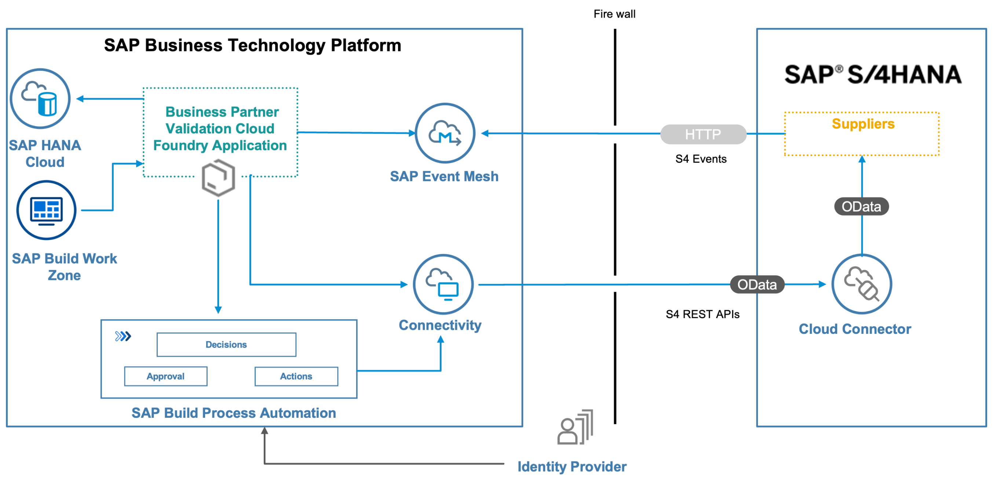

# Efficient SAP S/4HANA Side-by-Side Extension with SAP Build Process Automation

## Description
The main intent of this scenario is to put an event-driven architecture into action by automating business processes through SAP Build Process Automation and also by building an extension application on SAP Business Technology Platform using SAP Cloud Application Programming Model (CAP) which consumes and further processes the SAP S/4HANA On-premise business events.

This application showcases:

- Building applications on SAP Business Technology Platform (BTP) using [SAP Cloud Application Programming Model(CAP)](https://cap.cloud.sap/docs/)
- Consuming events from SAP S/4HANA on premise using [SAP Event Mesh](https://help.sap.com/viewer/bf82e6b26456494cbdd197057c09979f/Cloud/en-US/df532e8735eb4322b00bfc7e42f84e8d.html)
- Consuming REST APIs from SAP S/4HANA on premise using SAP Business Technology Platform Connectivity Service
- SAP Process Automation (workflow, business events, actions)

## Business Scenario

As Supplier Relationship Manager of ACME Corporation Jane would like to have a curated mechanism to onboard new suppliers. The newly onboarded suppliers needs to go through multiple validations before ACME starts to do business with the supplier.

- A Supplier Relationship executive would like to have a minimalistic form to onboard the supplier.
- Jane would like to get a notification for approval whenever a new Supplier is onboarded.
- ACME would like the Supplier to be validated by iCredible (Third-party Business Partner Validation firm).
- John an employee iCredible (Third-party Business Partner Validation firm) would like to get notification when ever new suppliers are added to SAP S/4HANA  system of ACME. 

    

- John can then proceed to validate the supplier.
- Once John’s verification is completed, Jane would like to get a notification to approve and unblock payments and creation of purchase orders of the new Supplier

    

## Architecture

### Solution Diagram

The Business Partner Validation application is developed using the SAP Cloud Application programming Model (CAP) and runs on the SAP BTP Cloud Foundry runtime. It consumes platform services like SAP Event Mesh, SAP HANA and Connectivity. The events occuring in SAP S/4HANA on premise are inserted into the SAP Event Mesh queue. The application running in Cloud Foundry is notified on events, consumes them from the queue and inserts the event data into the HANA database. The Business Partner Validation Application uses SAP S/4HANA REST API's to read additional Business Partner Data from the S/4 HANA system.

## Focus Topics of the Mission

The tutorial focus on the following aspects:

 * Building a side-by-side extension to [SAP S/4HANA](https://help.sap.com/docs/SAP_S4HANA_ON-PREMISE?state=DRAFT).
 * Setting up Eventing and consuming events from SAP S/4HANA using [SAP Event Mesh](https://help.sap.com/docs/SAP_EM?version=Cloud).
 * Automating processes using [SAP Build Process Automation](https://help.sap.com/docs/PROCESS_AUTOMATION?version=Cloud).
 * Developing an application on [SAP BTP](https://help.sap.com/docs/btp?version=Cloud) using [Cloud Application Programming Model](https://cap.cloud.sap/docs/).
 * Implementing a [SAP Fiori elements](https://help.sap.com/docs/SAP_FIORI_tools) UI.
 * Integrating [SAP Build Process Automation](https://help.sap.com/docs/PROCESS_AUTOMATION?version=Cloud) with [Cloud Application Programming Model](https://cap.cloud.sap/docs/).

## Requirements
* SAP S/4HANA on premise system.
* SAP Business Technology Platform account

### For local development you would require the following:
* [Node js](https://nodejs.org/en/download/)
>Make sure you run the latest long-term support (LTS) version of Node.js with an even number like 16. Refrain from using odd versions, for which some modules with native parts will have no support and thus might even fail to install. In case of problems, see the [Troubleshooting guide](https://cap.cloud.sap/docs/advanced/troubleshooting#node-version) for CAP for more details.
* [Cloud Foundry Command Line Interface (CLI)](https://github.com/cloudfoundry/cli#downloads)
* [Visual Studio Code](https://cap.cloud.sap/docs/get-started/in-vscode)
* [cds-dk](https://cap.cloud.sap/docs/get-started/)
* [SQLite ](https://sqlite.org/download.html)
* To build the multi target application, we need the [Cloud MTA Build tool](https://sap.github.io/cloud-mta-build-tool/), download the tool from [here](https://sap.github.io/cloud-mta-build-tool/download/)
* For Windows system, install 'MAKE' from https://sap.github.io/cloud-mta-build-tool/makefile/
* [multiapps plugin](https://github.com/cloudfoundry-incubator/multiapps-cli-plugin) - `cf install-plugin multiapps`  
*  mbt -  `npm install -g mbt`

## Where to Start?

* Follow the below steps for quick start or start the [SAP Discovery Center Mission](https://discovery-center.cloud.sap/missions).

    |   **Step**  |  **Description** | 
    | ----------- | ----------- | 
    | **Step 1**: [Prerequisites](./documentation/prepare/README.md) | Prepare your systems such as exploring APIs and events, configure global account using Boosters and so on.| 
    | **Step 2**: [Setup](./documentation/set-up/README.md) | Configure and Subscribe instances like SAP HANA Cloud, SAP Build Process Automation, setup connectivity between SAP S/4HANA and SAP BTP and so on. | 
    | **Step 3**: [Configure Business Processes](./documentation/develop/README.md)  | Configure Actions, Decisions and Business Processes using SAP Build Process Automation. |
    | **Step 4**: [Deploy Cloud Application Programming(CAP) and Integrate with Central Fiori Launchpad](./documentation/deploy/README.md)| Develop and Deploy CAP Application and integrate with launchpad using SAP Build Work Zone |
    | **Step 6**: [Configure Event-Based Communication between SAP S/4HANA and SAP Event Mesh](./documentation/deploy/configure-channel/README.md) | Configure outbound messaging in SAP S/4HANA and add bindings. |
    | **Step 7**: [Run the Example Scenario](./documentation/deploy/run-e2e/README.md) | Run End to End scenario |

## Known Issues

No known issues.

## How to Obtain Support

In case you find a bug, or you need additional support, please [open an issue](https://github.com/SAP-samples/s4hana-cloud-extension-process-automation/issues/new) here in GitHub.

## License
Copyright (c) 2020 SAP SE or an SAP affiliate company. All rights reserved. This project is licensed under the Apache Software License, version 2.0 except as noted otherwise in the [LICENSE](LICENSES/Apache-2.0.txt) file.

