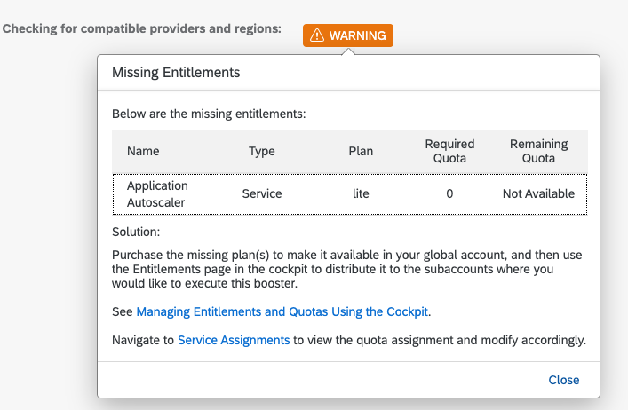
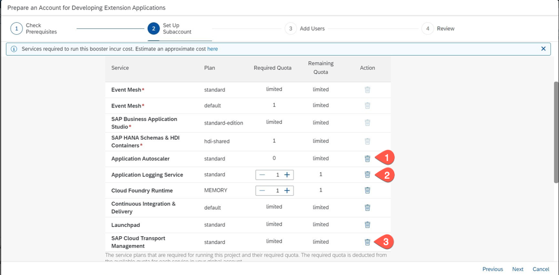
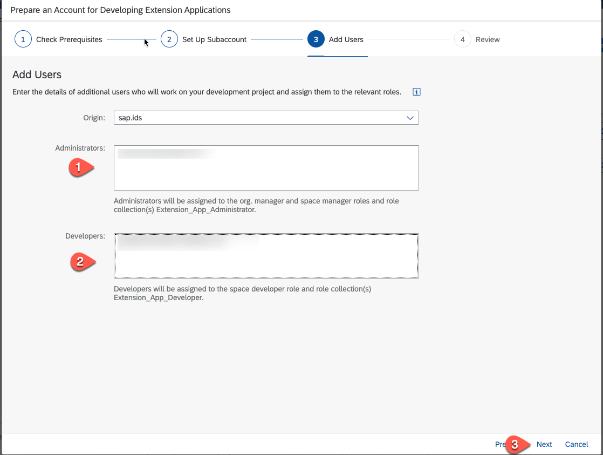
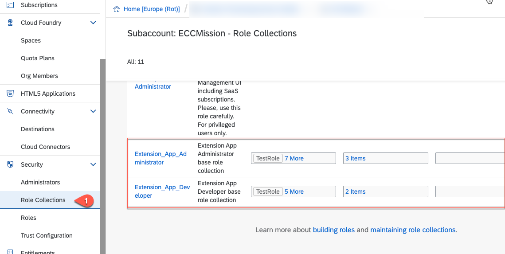

# Configure Your Global Account in SAP BTP Using a Booster

# Set Up an Account in SAP Business Technology Platform Using a Booster

## Introduction

For running the Extend SAP S/4HANA with SAP Build Process Automation mission, you will need the following services in your account in SAP Business Technology Platform (SAP BTP).

* SAP Business Application Studio
* SAP Event Mesh
* SAP BTP, Cloud Foundry runtime
* SAP Build Work Zone, standard edition
* SAP HANA Cloud for SAP BTP
* SAP Build Process Automation
* SAP Continuous Integration & Delivery service (optional)

The entitlement differs for the pricing option of your account:

**Consumption-based account in SAP BTP:** 
No entitlement is necessary. Be sure that you have enough credits to run the services.

**Subscription-based account in SAP BTP:** 
You have to create entitlements for the services above. See [Entitlements and Quotas](https://help.sap.com/viewer/df50977d8bfa4c9a8a063ddb37113c43/Cloud/en-US/38ecf59cdda64150a102cfaa62d5faab.html#loio363f0f68f9704830ac65c87a2562559b).

[Check the costs with the SAP BTP Estimator Tool](https://www.sap.com/products/cloud-platform/pricing/estimator-tool.html?blueprintId=a0ad3bc5-4fcb-4008-b109-bd8f70634d6c)

**Booster:**

The setup of these services could be done for each service individually. To simplify the setup process, you can use the boosters in the SAP BTP cockpit. Boosters are a collection of wizards that provide functionalities for specific scenarios to automate and speed-up the installation and configuration process of a subaccount it SAP BTP. This includes the user management with the mapping of the respective Administrator and Developer roles.

For this mission, you can use the **Prepare an account for Developing Extension Applications** booster. Before running the booster, please check for which regions and infrastructures the services are available. See [SAP BTP Regions and Service Portfolio ](https://help.sap.com/doc/aa1ccd10da6c4337aa737df2ead1855b/Cloud/en-US/3b642f68227b4b1398d2ce1a5351389a.html).

Unfortunately, the booster is not able to check this in advance, so it will fail when you select a region where a service is not available.

**Audience:** Administrator (SAP BTP)

## Step-by-step

### A: Run the Booster

1. Start the booster.
   1. Log in to SAP BTP cockpit and navigate to your global account in SAP BTP.
   2. Choose **Boosters**.
   3. Select **Extension Suite - Development Efficiency** from the drop-down menu.
   4. Select the **Prepare an account for Developing Extension Applications** booster.
   
   

2. Read the overview of the **Prepare an account for Developing Extension Applications** booster.

   
 
3. Choose **Components** to check what components and services take part of the booster. You can also view the cost estimate for running this scenario in a productive account. Choose **Start**.

   

4. Check the prerequisites. If all the prerequisites are met, choose **Next**.
   

   > Hint: If you get a warning, check which services are affected. If they are not relevant for this mission, (see the next step) you can just ignore it.
   
   

5. Set up your subaccount.
   
You find the list of the services that will be activated by this booster. For this mission, the **SAP Continuous Integration & Delivery** service is optional. Remove it if you don't want to use it.
Services like **Application Autoscaler**, **Application Logging**, and the **SAP Cloud Transport Management Service** are not used in this  mission, you can remove them.     
   
   

   >By using a subscription-based account in SAP BTP, you have to set the quota of the **SAP BTP, Cloud Foundry runtime** to 3
   
   
   1. Enter a meaningful subaccount name. In general, it reflects the organization of your team.
   2. Select your provider. For example, Amazon Web Services (AWS).
   3. Select the region.
   4. Enter a meaningful Org name.
   5. Enter a space name. This should reflect the name of your project.
   6. Choose **Next**.  
  
   

6. Add users.
   1. Enter the User ID (mail address) of all Administrator users.
   2. Enter the User ID (mail address) of all Developer users.
   3. Choose **Next**.
   
   

7. Review your settings and choose **Finish**.
   
   

8.  Check the progess - all sections should become green.
   
    

9. If you succeed, navigate to the new subaccount.

    

10. To check your subaccount, choose **Security** > **Role Collection**.
    You will find the **Extension\_App\_Administrator** and the **Extension\_App\_Developer** role collections. If you want to add more users to the mission, you have to assign to their users one of these role collections.

    

    Go to **Instances and Subscriptions** and choose the **Subscription** tab. Check if the following subscriptions are enabled:
    * SAP Business Application Studio
    * SAP Event Mesh
    * SAP SAP Build Work Zone, standard edition
    * SAP Continuous Integration & Delivery (only when selected in the booster)   
    
    
