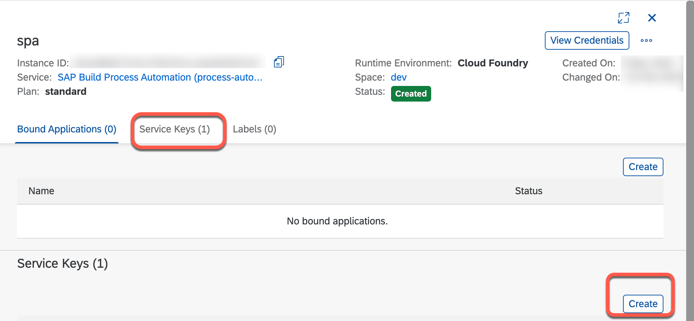
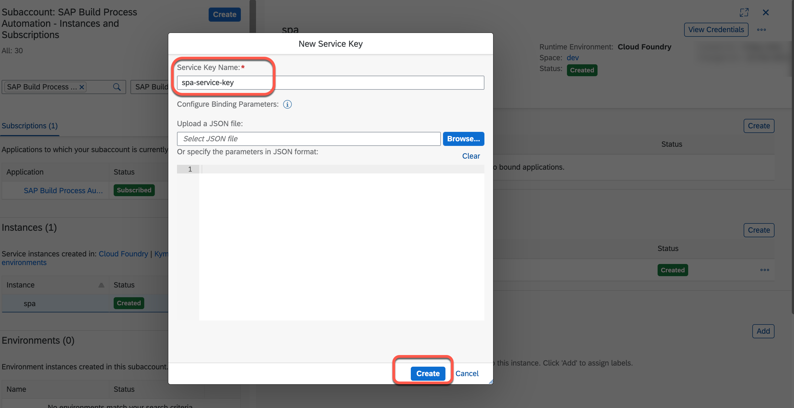
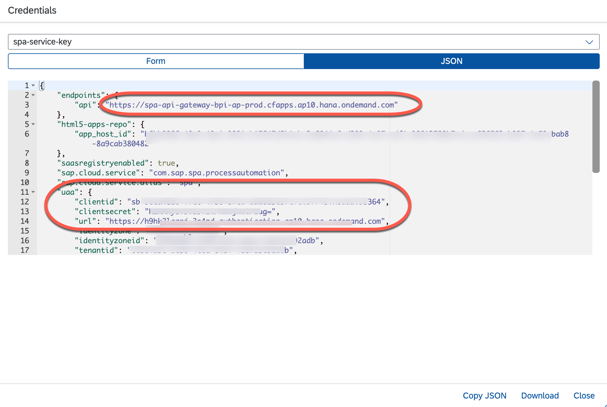

## Subscribe and Configure SAP Build Process Automation in SAP BTP

In this section, you will learn how to subscribe and create service for SAP Build Process Automation in SAP BTP, assign the necessary roles and authorization. You will also learn how to create a service key for a service instance and configure a workflow destination from a service key.

### Subscribe to SAP Build Process Automation
    
1. In SAP BTP cockpit navigate to the **Services** > **Instances and Subscriptions** > choose **create**.

   

2. In the **service** field choose **SAP Build Process Automation**.

3. In the **Plan** choose **standard**.

   

4. Choose **Create**.

    

## Assign Roles to Users to get access to the SAP Build Process Automation Lobby

- SAP Build Process Automation uses the following role collections:

    | **Role Collection**  |  **Description** | 
    | ----------- | ----------- | 
    | **ProcessAutomationAdmin**  | **Manages the process configuration, permissions, and authorizations within SAP Build Process Automation** | 
    | **ProcessAutomationDeveloper**     | **Manages the creation, editing, and publishing of individual processes and automations within SAP Build Process Automation**  | 
    | **ProcessAutomationParticipant**     | **Participates in active SAP Build Process Automation processes.**  |

-  Procedure

    1. Open the SAP BTP cockpit.
    2. Go to your global account and subaccount (see Navigate in the Cockpit).
    3. Choose Security > Role Collections.
    4. Choose the role collection to which you want to assign users.
    5. Go to the Users section and choose Edit.
    6. Enter the user ID of the user that you want to assign to the role collection. If the user only exists in a connected identity provider, you must choose the identity provider and type in the e-mail address.
    7. (Optional) To add more users, choose (Add a user).
    8. Save your changes.

You've now assigned this user to the role collection. The user has all of the authorizations of the role collection. You will now be able to access the lobby.

   

### Create a SAP Build Process Automation Instance

1. In SAP BTP cockpit navigate to the **Services** > **Instances and Subscriptions** > choose **create**.

   

2. In the **service** field choose **SAP Build Process Automation**.

3. In the **Plan** choose **standard**.

4. In the **Runtime Environment** field , choose **Cloud Foundry**.

5. Choose **Space**.

6. In the **Instance Name** field, enter **spa**.

7. Choose **Create**.

   

8. Choose **Create**.

   

### Create a SAP Build Process Automation Instance Service Key

1. In the **spa** instance, choose **Service Keys**.

2. Choose **Create**.

   

3. In the **Service Key Name** field, enter **spa-service-key**.

4. Choose **Create**.

   

### Configure Workflow Destination in SAP BTP

1. Choose Service Key **spa-service-key** . A JSON file is displayed. Find the following information in this JSON:
    - endpoints.api
    - uaa.clientid
    - uaa.clientsecret
    - uaa.url

    

2. Create a new Destination.

    1. Open the **Connectivity** entry and choose **Destination***.
    2. Choose New Destination.
    3. In the **Name** field, enter **bpmworkflowruntime**.
    4. In the **Type** field, choose**HTTP**.
    5. Enter **Description**.
    6. In the **Proxy Type**, choose choose **Internet**
    7. In the **URL** field, enter **<endpoints.api>** as a URL which you got from Service key **spa-service-key**, refer to the previous step for the Service key Information.
    8. In the **Authentication**, choose **OAuth2ClientCredentials**.
    9. In the **Client ID** field, enter **uaa.clientid** which you got from service key, refer to the previous step for the Service key Information.
    10. In the **Client Secret**, enter **uaa.clientsecret** which you got from service key.
    11. In the **Token Service URL** field, enter **<endpoints.url>** as a URL which you got from service key **/oauth/token**, refer to the previous step for the Service key Information.
    12. Choose **Save**.

    

    13. Choose **Check Connection**

    

